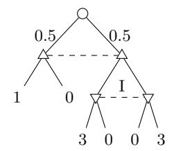
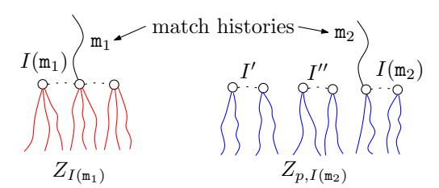
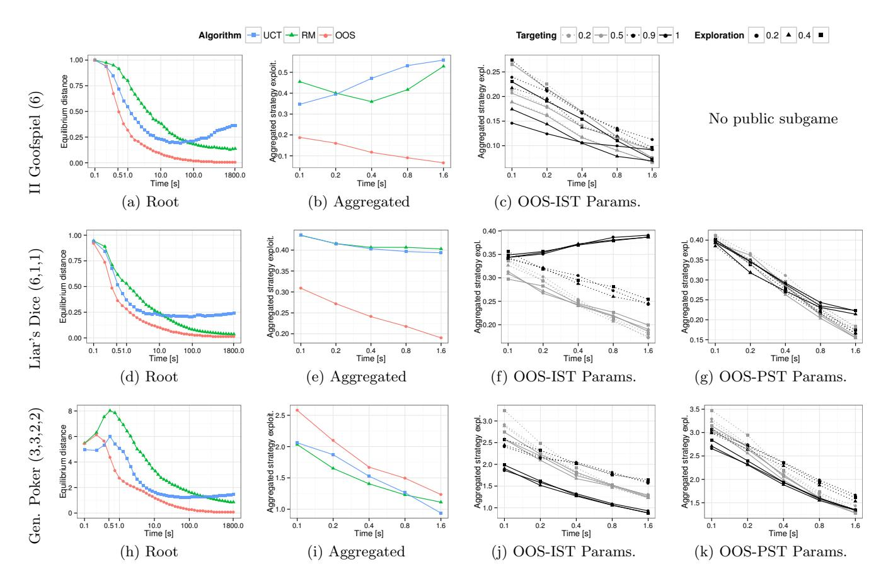

# **Online Monte Carlo Counterfactual Regret Minimization for Search in Imperfect Information Games**

Viliam Lisý Dept. Computer Science, FEE Czech Technical University in Prague, Czech Republic lisy@agents.fel.cvut.cz

Marc Lanctot ∗ Dept. Knowledge Engineering Maastricht University The Netherlands marc.lanctot@gmail.com

Michael Bowling Dept. Computing Science University of Alberta, Edmonton, Canada bowling@cs.ualberta.ca

# ABSTRACT

Online search in games has been a core interest of artificial intelligence. Search in imperfect information games (e.g., Poker, Bridge, Skat) is particularly challenging due to the complexities introduced by hidden information. In this paper, we present Online Outcome Sampling, an online search variant of Monte Carlo Counterfactual Regret Minimization, which preserves its convergence to Nash equilibrium. We show that OOS can overcome the problem of non-locality encountered by previous search algorithms and perform well against its worst-case opponents. We show that exploitability of the strategies played by OOS decreases as the amount of search time increases, and that preexisting Information Set Monte Carlo tree search (ISMCTS) can get more exploitable over time. In head-to-head play, OOS outperforms ISMCTS in games where non-locality plays a significant role, given a sufficient computation time per move.

# Categories and Subject Descriptors

I.2.1 [Artificial Intelligence]: Applications and Expert Systems—Games

# General Terms

Algorithms

# Keywords

Imperfect information games; online search; Nash equilibrium; Monte Carlo tree search; regret minimization

# 1. INTRODUCTION

Algorithms for creating strong strategies in games have been a core interest of artificial intelligence research. Strong strategies are useful not only as research benchmarks and opponents in digital entertainment, but they are becoming

Appears in: Proceedings of the 14th International Conference on Autonomous Agents and Multiagent Systems (AAMAS 2015), Bordini, Elkind, Weiss, Yolum (eds.), May 4–8, 2015, Istanbul, Turkey. Copyright c 2015, International Foundation for Autonomous Agents and Multiagent Systems (www.ifaamas.org). All rights reserved.

increasingly important also in real world applications, such as critical infrastructure security [36]. Because these games are often played against unknown opponents, a good strategy should be sufficiently robust against any possible counterstrategy used by the adversary. In strictly competitive games, the strategy that is optimal with respect to this criterion is the Nash equilibrium. It is guaranteed to provide the maximal possible expected value against any strategy of the opponent. For example, an equilibrium defense strategy minimizes the maximal damage caused by any attack.

When preparation time is abundant and the exact problem definition is known in advance, an equilibrium strategy for a smaller abstract game can be pre-computed and then used during game play. This offline approach has been remarkably successful in Computer Poker [2, 12, 32, 31, 21]. However, the preparation time is often very limited. The model of the game may become known only shortly before acting is necessary, such as in general game-playing, search or pursuit in a previously unknown environment, and general-purpose robotics. In these circumstances, creating and solving an abstract representation of the problem may not be possible. In these cases, agents must decide online: make initial decisions quickly and then spend effort to improve their strategy while the interaction is taking place.

In this paper, we propose a search algorithm that can compute an approximate Nash equilibrium (NE) strategy in two-player zero-sum games online, in a previously unknown game, and with a very limited computation time and space. Online Outcome Sampling (OOS) is a simulationbased algorithm based on Monte Carlo Counterfactual Regret Minimization (MCCFR) [24]. OOS makes two novel modifications to MCCFR. First, OOS builds its search tree incrementally, like Monte Carlo tree search (MCTS) [7, 3, 22]. Second, when performing additional computation after some moves have been played in the match, the following samples are targeted primarily to the parts of the game tree, which are more relevant to the current situation in the game. We show that OOS is consistent, i.e. it is guaranteed to converge to an equilibrium strategy as search time increases. To the best of our knowledge, this is not the case for any existing online game playing algorithm, all of which suffer from the problem of non-locality in these games.

We compare convergence and head-to-head performance of OOS to Information Set MCTS [8, 37, 25] in three fundamentally different games. We develop a novel methodology for evaluating convergence of online algorithms that do not produce a complete strategy. The results show that OOS, unlike ISMCTS, consistently converges close to NE strat-

<sup>∗</sup>This author has a new affiliation: Google DeepMind, London, United Kingdom.

egy in all three games. In head-to-head performance, with sufficient time, OOS either ties or outperforms ISMCTS.

## 2. BACKGROUND AND RELATED WORK

Most imperfect information search algorithms are built upon perfect information search algorithms, such as minimax or Monte Carlo tree search (MCTS). One of the first popular applications of imperfect information search was Ginsberg's Bridge-playing program, GIB [15, 16]. In GIB, perfect information search is performed on a determinized instance of the game: one where all players can see usually hidden information. This approach has also performed well in other games like Scrabble [34], Hearts [35], and Skat [5].

Several problems have been identified with techniques based on determinization, such as Perfect Information Monte Carlo (PIMC) [28]. Two commonly reported problems are *strategy fusion* and *non-locality* [9]. Strategy fusion occurs when distinct actions are recommended in states that the player is not able to distinguish due to the imperfect information. Strategy fusion can be overcome by imposing the proper information constraints during search [9, 6, 30, 26, 8].

Non-locality occurs due to optimal payoffs not being recursively defined over subgames as in perfect information games. As a result, guarantees normally provided by search algorithms built on subgame decomposition no longer hold. Previous work has been done for accelerating offline equilibrium computation by solving subgames in end-game situations [13, 14, 11]. While these techniques tend to help in practice, non-locality can prevent them from producing equilibrium strategies; we discuss this further in Section 2.2.

The last problem is the need for randomized strategies in imperfect information games. In many games, any deterministic strategy predictable by the opponent can lead to arbitrarily large losses. To overcome this problem, MCTS algorithms sometimes randomize by sampling actions from its empirical frequency counts. Evidence suggests that the resulting strategies will not converge to the optimal solution even in very small imperfect information games like Biased Rock-Paper-Scissors and Kuhn poker [33, 30]. Our results show that, the empirical frequencies can diverge away from the equilibrium strategies. A little more promising are the MCTS approaches that use alternative selection functions, such as Exp3 or Regret Matching [25]. Variants of MCTS with these selection functions have been shown both formally and empirically [27, 23] to converge to Nash equilibrium in games with simultaneous moves, which are the simplest subclass of imperfect information games. However, we show that even these selection functions cannot help to overcome the problem of non-locality.

#### 2.1 Extensive-Form Games

We focus on two-player zero-sum extensive form games and base our notation on [29]. These games model sequential decision making **players** denoted  $i \in N = \{1, 2\}$ . In turn, players choose **actions** leading to sequences called **histories**  $h \in H$ . A history  $z \in Z$ , where  $Z \subseteq H$ , is called a **terminal history** and represents a full game from start to end. At each terminal history z there is a payoff  $u_i(z)$  to each player z. At each nonterminal history z, there is a single current player to act, determined by z and z by z by z where z is a special player called **chance** that plays with a fixed stochastic strategy. For example, chance is used to represent rolls of dice and card draws. The game starts in the empty



Figure 1: An extensive-form game demonstrating the problem of non-locality with maximizing  $\triangle$ , minimizing  $\nabla$  and chance  $\bigcirc$  players.

history  $\emptyset$ , and at each step, given the current history h, the current player chooses an action  $a \in A(h)$  leading to successor history h' = ha; in this case we call h a **prefix** of h' and denote this relationship by  $h \sqsubset h'$ . Also, for all  $h, h', h'' \in H$ , if  $h \sqsubset h'$  and  $h' \sqsubset h''$  then  $h \sqsubset h''$ , and  $h \sqsubset h$ . Sets H and A(h) are finite and histories have finite length.

Set  $\mathcal{I}_i$  is an partition over  $H_i = \{h \mid P(h) = i\}$  where each part is called an **information set**. Intuitively, an information set  $I \in \mathcal{I}_i$  of player i represents a state of the game with respect to what player i knows. Formally, I is a set of histories that a player cannot tell apart (due to information hidden from that player). For all  $h, h' \in I$ , A(h) = A(h') and P(h) = P(h'); hence, we extend the definition to A(I), P(I), and denote I(h) the information set containing h.

A behavioral strategy for player i is a function mapping each information set  $I \in \mathcal{I}_i$  to a probability distribution over the actions A(I), denoted by  $\sigma_i(I)$ . For a profile  $\sigma$ , we denote the probability of reaching a terminal history z under  $\sigma$  as  $\pi^{\sigma}(z) = \prod_{i \in N \cup c} \pi_i(z)$ , where each  $\pi_i(z) = \prod_{ha \sqsubseteq z, P(h)=i} \sigma_i(I(h), a)$  is a product of probabilities of the actions taken by player i along z. We use  $\pi_i^{\sigma}(h, z)$  and  $\pi^{\sigma}(h, z)$  for  $h \sqsubseteq z$  to refer to the product of only the probabilities of actions along the sequence from the end of h to the end of h. Define h is convention, h is effect to player h is opponent.

An  $\epsilon$ -Nash equilibrium,  $\sigma$ , is a set of  $\sigma_i$  for  $i \in N$  such that the benefit of switching to some alternative  $\sigma_i'$  is limited by  $\epsilon$ , i.e.,  $\forall i \in N : \max_{\sigma_i' \in \Sigma_i} u_i(\sigma_i', \sigma_{-i}) - u_i(\sigma) \leq \epsilon$ . When  $\epsilon = 0$ , the profile is called a Nash equilibrium. When |N| = 2 and  $u_1(z) + u_2(z) = k$  for all  $z \in Z$ , then the game is a zero-sum game. In these games, different equilibrium strategies result in the same expected payoff against any arbitrary opponent equilibrium strategy and at least the same payoff for any opponent strategy. The **exploitability** of a profile  $\sigma$  is the sum of strategies' distances from an equilibrium,  $\epsilon_{\sigma} = \max_{\sigma_i' \in \Sigma_1} u_1(\sigma_1', \sigma_2) + \max_{\sigma_2' \in \Sigma_1} u_2(\sigma_1, \sigma_2')$ .

In a **match** (online game), each player is allowed little or no preparation time before playing (preventing the offline computation of approximate equilibria solutions). The current **match history**,  $m \in H$ , is initially the empty history  $\emptyset$  representing the start of the match. Each turn, player P(m) is given t time units to decide on a **match action**  $\mathbf{a} \in A(m)$  and the match history then changes from  $\mathbf{m}$  to  $\mathbf{ma}$ . There is a referee who knows  $\mathbf{m}$ , samples chance outcomes from  $\sigma_c(\mathbf{m})$ , and reveals I(m) to player P(m). The match terminates when  $\mathbf{m} \in Z$ , giving each player i a payoff of  $u_i(m)$ .

## 2.2 The Problem of Non-Locality

We demonstrate the problem of non-locality on the game in Figure 1. It starts with a decision of chance  $\bigcirc$  which leads to two nodes that cannot be distinguished by the maximiz-

ing player  $\triangle$ . On the left, the game ends after his actions. On the right, both his actions lead to information set I of the minimizing player  $\nabla$ , whose utility is minus the depicted value. The optimal (Nash equilibrium) strategy in I depends on the value of the leftmost leaf, even though this outcome of the game cannot be reached once the game entered information set I. Because  $\triangle$  does not know at the time of his move if  $\nabla$  will play, he needs to randomize its decision so that  $\nabla$  cannot easily make the move that is more harmful for  $\triangle$ . However, he would prefer to play left for the case that  $\nabla$ will not play. Player  $\nabla$  knows that  $\triangle$  has this dilemma and tries to exploit it as much as possible. Uniform strategy at Iclearly motivates  $\triangle$  to play left, leading to expected utility  $0.5 \cdot 1 + 0.5 \cdot 1.5 = 1.25$ , instead of  $0.5 \cdot 0 + 0.5 \cdot 1.5 = 0.75$ . If  $\nabla$  plays right a little more often,  $\triangle$  is still motivated to play left and  $\nabla$  plays (left,right) with probabilities  $(\frac{1}{3},\frac{2}{3})$ , which results to expected reward of 1 for both actions of  $\triangle$ . If  $\triangle$  plays  $(\frac{1}{2},\frac{1}{2}), \nabla$  cannot lower the utility anymore and the pair of strategies is an equilibrium. If the leftmost leaf was 2 instead of 1, the optimal strategy in I would be  $(\frac{1}{6}, \frac{5}{6})$ .

Current approaches, after reaching the information set I, will repeatedly sample and search one of subtrees in I, aggregating the information collected to make a final recommendation. However, even if the information structure is kept intact, such as in ISMCTS [8], the problem still occurs. If subtrees of I are sampled equally often, a searching player will not have any preference between left and right and will recommend  $(\frac{1}{2}, \frac{1}{2})$ , which is suboptimal. Moreover, the uniform probability of being in each state of I corresponds to the distribution over the states given the optimal play, so the problem occurs even if subtrees are sampled from the correct belief distribution. Note that this is a simple example; in larger games, this problem could occur over much longer paths or many times in different parts of the game. The analysis in [28] suggests that the effect may be critical in games with low disambiguation factor, where private information is slowly (or never) revealed throughout a match.

To the best of our knowledge, OOS is the first online search algorithm that solves this problem. It does it by starting each sample from the root of the game. If the computed strategy tends to come closer to the uniform strategy in I, the updates in the maximizing player's information set will modify the strategy to choose left more often. The following samples will reach I more often at the left state and consequently modify the strategy in I in the right direction.

## 2.3 Offline Equilibrium Approximation

There are multiple algorithms for computing approximate equilibrium strategies offline [32]. We focus on a popular choice among Poker researchers due to its sampling variants.

Counterfactual Regret (CFR) is a notion of regret at the information set level for extensive-form games [38]. The CFR algorithm iteratively learns strategies in self-play, converging to an equilibrium. The **counterfactual value** of reaching information set I is the expected payoff given that player i played to reach I, the opponents played  $\sigma_{-i}$  and both players played  $\sigma$  after I was reached:

$$v_i(I,\sigma) = \sum_{(h,z)\in Z_I} \pi_{-i}^{\sigma}(h)\pi^{\sigma}(h,z)u_i(z), \tag{1}$$

where  $Z_I = \{(h, z) \mid z \in Z, h \in I, h \sqsubset z\}$ . Suppose, at time t, player i plays with strategy  $\sigma_i^t$ . Define  $\sigma_{I \to a}^t$  as identical

to  $\sigma^t$  except at I action a is taken with probability 1. The counterfactual regret of not taking  $a \in A(I)$  at time t is  $r^t(I,a) = v_i(I,\sigma^t_{I\to a}) - v_i(I,\sigma^t)$ . The algorithm maintains the cumulative regret  $R^T(I,a) = \sum_{t=1}^T r^t(I,a)$ , for every action at every information set. Then, the distribution at each information set for the next iteration  $\sigma^{T+1}(I)$  is obtained using regret-matching [17]. The distribution is proportional to the positive portion of the individual actions' regret:

$$\sigma^{T+1}(I,a) = \left\{ \begin{array}{ll} R^{T,+}(I,a)/R^{T,+}_{sum}(I) & \text{if } R^{T,+}_{sum}(I) > 0 \\ 1/|A(I)| & \text{otherwise,} \end{array} \right.$$

where  $x^+ = \max(0, x)$  for any term x, and  $R_{sum}^{T,+}(I) = \sum_{a' \in A(I)} R^{T,+}(I, a')$ . Furthermore, the algorithm maintains for each information set the average strategy profile

$$\bar{\sigma}^{T}(I, a) = \frac{\sum_{t=1}^{T} \pi_{i}^{\sigma^{t}}(I) \sigma^{t}(I, a)}{\sum_{t=1}^{T} \pi_{i}^{\sigma^{t}}(I)},$$
(2)

where  $\pi_i^{\sigma^t}(I) = \sum_{h \in I} \pi_i^{\sigma^t}(h)$ . The combination of the counterfactual regret minimizers in individual information sets also minimizes the overall average regret [38], and hence the average profile is a  $2\epsilon$ -equilibrium, with  $\epsilon \to 0$  as  $T \to \infty$ .

Monte Carlo Counterfactual Regret Minimization (MC-CFR) applies CFR to sampled portions of the games [24]. In the **outcome sampling** (OS) variant of the algorithm, a single terminal history  $z \in Z$  is sampled in each iteration. The algorithm updates the regret in the information sets visited along z using the **sampled counterfactual value**,

$$\tilde{v}_i(I,\sigma) = \begin{cases} \frac{1}{q(z)} \pi^{\sigma}_{-i}(h) \pi^{\sigma}(h,z) u_i(z) & \text{if } (h,z) \in Z_I \\ 0 & \text{otherwise,} \end{cases}$$

where q(z) is the probability of sampling z. If every  $z \in Z$  has non-zero probability of being sampled,  $\tilde{v}_i(I,\sigma)$  is an unbiased estimate of  $v(I,\sigma)$  due to the importance sampling correction (1/q(z)). For this reason, applying CFR updates using these sampled counterfactual values on the sampled information sets values also eventually converges to the approximate equilibrium of the game with high probability.

#### 3. ONLINE OUTCOME SAMPLING

When outcome sampling is used in the offline setting, data structures for all information sets are allocated before the first iteration. In each iteration, all sampled information sets get updated. We make two essential modifications to adapt outcome sampling to the online setting.

Incremental Game Tree Building. Before the match begins, only the very first (root) information set is added to memory. In each iteration, a single information set (at most) is added to memory. In particular, when an information set is reached that is not in memory, it is added to memory and then a default playout policy (e.g., uniform random) takes over for the remainder of the simulation. Along the playout portion (tail) of the simulation, information sets are not added to memory nor updated. Along the tree portion (head), information sets are updated as normal. This way, only the relevant information sets are stored in the memory.

In-Match Search Targeting. Suppose several moves have been played since the start of the match leading to m. Plain outcome sampling would continue to sample from the root of the game (not the current match history m), rarely reaching the region of the game space that the match has headed toward. Hence, the second modification we propose



Figure 2: Example subgames targeted by IST (left) and PST (right). All histories  $\{ h \mid h \in I' \cup I'' \cup I(\mathfrak{m}_2) \}$  share a common public action sequence  $(p(\mathfrak{m}_2))$ .

is directing the search towards the histories that are more likely to occur during the match currently played. Note that the complete history is typically unknown to the players, who know only their information sets. Unlike in ISMCTS, OOS always runs samples from the root of the game tree, even with non-empty match history. We now describe two specific targeting methods demonstrated in Figure 2.

## 3.1 Information Set Targeting (IST)

Suppose the match history is m. IST samples histories reaching the current information set  $(I(\mathbf{m}))$ , i.e.,  $(h,z) \in Z_{I(\mathbf{m})}$ , with higher probability than other histories. The intuition is that these histories are particularly relevant since the searching player knows that one of these z will describe the match at its completion. However, focusing only on these histories may cause problems because of the non-locality and the convergence guarantees would be lost.

Consider again the game in Figure 1. If the minimizing player knows it is in the information set I and focuses all its search to this information set, she computes the suboptimal uniform strategy. Any fixed non-zero probability of sampling the left chance action eventually solves the problem. The regrets are multiplied by the reciprocal of the sampling probability; hence, they influence the strategy in the information set proportionally stronger if the samples are rare.

Note that previous methods, such as PIMC and ISMCTS, never update any information sets, which are not reachable from  $I(\mathfrak{m})$ . In contrast, in IST all information sets in memory have positive probability of being reached and updated.

## 3.2 Public Subgame Targeting (PST)

IST may "reveal" information about the current information set available to only one of the players affecting the computed strategy (this vanishes in the limit due to consistency but could have a short-term effect). PST only uses information available to both players to target the search to prevent this effect. A **public action** is an action in the "public tree" defined in [20] and commonly used in offline CFR. Informally, an action is said to be public if it is observable by all players (e.g., bids in Liar's Dice and bets in Poker are public). Formally, an action a is public, iff  $\forall i, \forall I \in \mathcal{I}_i, \forall h_1, h_2 \in I : a \in h_1 \Leftrightarrow a \in h_2$ . For example, the extensive-form version of Rock, Paper, Scissors has two information sets  $I_1 = \emptyset$  and  $I_2 = \{r, p, s\}$ ; it has no public actions, because each history in  $I_2$  contains a single unique action (the unobserved ones taken by the first player).

Given a history h, let p(h) be the sequence of public actions along h in the same order that they were taken in h. Define the **public subgame** induced by I to be the one

```
1 OOS(h, \pi_i, \pi_{-i}, s_1, s_2, i):
        if h \in Z then
 2
              return (1, \delta s_1 + (1 - \delta) s_2, u_i(z))
 3
        else if P(h) = c then
 4
 5
              Sample an outcome a and let \rho_1, \rho_2 be its
              probability in targeted and untargeted setting
              (x, l, u) \leftarrow OOS(ha, \pi_i, \rho_2 \pi_{-i}, \rho_1 s_1, \rho_2 s_2, i)
 6
              return (\rho_2 x, l, u)
 7
        I \leftarrow \text{getInfoset}(h, P(h))
 8
 9
        Let (a, s_1', s_2') \leftarrow \text{Sample}(h, I, i, \epsilon)
10
        if I is not in memory then
              Add I to memory
11
12
              \sigma(I) \leftarrow \mathrm{Unif}(A(I))
              (x, l, u) \leftarrow \text{Playout}(ha, \frac{\delta s_1 + (1 - \delta) s_2}{|A(l)|})
13
14
15
              \sigma(I) \leftarrow \text{RegretMatching}(r_I)
16
              \pi'_{P(h)} \leftarrow \sigma(I, a) \pi_{P(h)}
              \pi'_{-P(h)} \leftarrow \pi_{-P(h)}
17
              (x, l, u) \leftarrow OOS(ha, \pi'_i, \pi'_{-i}, s'_1, s'_2, i)
18
        c \leftarrow x
19
        x \leftarrow x\sigma(I, a)
20
        for a' \in A(I) do
21
              if P(h) = i then
22
                   W \leftarrow u \pi_{-i} \ / \ l
23
                   if a' = a then
\mathbf{24}
                        r_I[a'] \leftarrow r_I[a'] + (c-x)W
25
26
                        r_I[a'] \leftarrow r_I[a'] - xW
27
28
                   s_I[a'] \leftarrow s_I[a'] + \frac{1}{\delta s_1 + (1-\delta)s_2} \pi_{-i} \sigma(I, a')
29
30
        return (x, l, u)
```

Algorithm 1: Online Outcome Sampling.

whose terminal history set is

$$Z_{n,I(h)} = \{(h',z) \mid z \in Z, h' \in H, p(h') = p(h), h' \sqsubseteq z\}.$$

With match history m, PST samples  $z \in Z_{p,I(m)}$  with higher probability than terminal histories outside this set.

In a game of poker, suppose the chance decides on the private cards of the players, the first player bets one chip and the second player calls. At this point, the public actions are: bet one chip and call. The public subgame  $Z_{p,I(h)}$  contains every terminal history (including every combination of private chance outcomes for all players) whose first two public actions are: bet one chip and call.

## 3.3 Algorithm

The algorithm iteratively samples a single trajectory from the root  $\emptyset$  to a terminal history. At each information set in memory, I, it maintains two tables:  $r_I$  stores cumulative regret for each action  $a \in A(I)$ , and  $s_I$  stores the cumulative average strategy probability of each action.

Depending on the targeting method (IST or PST),  $Z_{sub}$  is one of  $Z_{I(m)}$  or  $Z_{p,I(m)}$ . The pseudo-code is presented as Algorithm 1. Each iteration is represented by two calls of OOS where the update player  $i \in \{1,2\}$  is alternated. Before each iteration, a *scenario* is decided: with probability  $\delta$  the iteration targets the subgame and chooses  $z \in Z_{sub}$  and with probability  $(1 - \delta)$  the usual OS sampling determines

 $z \in \mathbb{Z}$ . As a result, OOS with  $\delta = 0$  becomes MCCFR with incremental tree building.

The first parameter of OOS is the current history. The next two are strategy's reach probabilities for the update player i and the opponent. The third and fourth parameters are initially the overall probabilities that the current sample is generated, one for each scenario: first the targeted and then the untargeted. With non-empty match history, these two parameters include an additional weighting factor  $w_T$  explained later. The last parameter is the update player. Initial calls have the form  $OOS(\emptyset, 1, 1, 1/w_T, 1/w_T, i)$ . For the return values, x is a suffix/tail reach probability for both players, l is the root-to-leaf sample probability, and u is the payoff of the trajectory in view of the update player.

The  $\epsilon$ -on-policy sampling distribution used at each information set is defined as

$$\Phi(I,i) = \begin{cases} \epsilon \cdot \operatorname{Unif}(A(I)) + (1-\epsilon)\sigma_i(I) & \text{if } P(I) = i\\ \sigma_i(I) & \text{otherwise,} \end{cases}$$

and denote  $\Phi(I, i, a)$  the probability of sampling  $a \in A(I)$ .

The sampling at chance's choices on line 5 depends on the method and the scenario being used. For example, when using information set targeting, the outcome that is sampled must be consistent with match history.

A critical part of the algorithm is the action chosen and sample reach updates on line 9. If I is not in memory, then an action is sampled uniformly. Otherwise, in the targeted scenario, the current history h is always in the targeted part of the game and an action from  $\{a \mid \exists z \in Z \ (ha,z) \in Z_{sub}\}$  is selected using the distribution  $\Phi(I(h),i)$  normalized to one on this subset of actions. If we define  $sum = \sum_{(ha,z) \in Z_{sub}} \Phi(I,i,a)$  then  $s'_1 = s_1 \Phi(I,i,a)/sum$ . In the untargeted scenario, any action  $a \sim \Phi(I,i)$  can be sampled. If the action is not leaving the targeted part of the game (i.e.,  $(ha,z) \in Z_{sub}$ ) then  $s'_1 = s_1 \Phi(I,i,a)/sum$  otherwise  $s'_1 = 0$ . In all cases  $s'_2 = \Phi(I,i,a)s_2$ .

These sample reach probabilities are combined into one at a terminal history on line 3, start of the playout on line 13, and when updating the average strategy on line 29.

The playout on line 13 samples to the end of the game with some playout policy at each step; we use uniform random, but in general one could use an informed policy based on domain knowledge as well. Unlike MCTS, the playout policy in OOS must compute l when reaching a terminal and update the tail probability x when returning as done on line 20. Lines 16 and 17 modify P(h)'s reach probability by multiplying it by  $\sigma(I,a)$ , keeping the other value the same. Lines 19 to 24 contain the usual outcome sampling updates. Note that regrets are updated at the update player histories, while average strategy tables at opponent histories.

Now we explain the role of the weighting factor  $w_T$ . Note that on lines 23 and 29, the regret and strategy updates are multiplied by the reciprocal of the probability of sampling the sample leaf and the current state. Consider the updates in the current information set of the game  $I_{\rm m}$ . In the initial samples of the algorithm with empty match history, this information set was on average sampled with a very low probability  $s_0$ . Let's say that out of  $10^6$  samples started from the root, 1000 samples reached this particular information set. In that case,  $s_0=0.001$  and the regret updates caused by each of these samples were multiplied by  $\frac{1}{s_0}=1000$ . Now the game has actually reached the history m

and due to targeting, half of the next  $10^6$  samples reach  $I(\mathfrak{m})$ . It means that  $s_{\mathfrak{m}}=0.5$  and the regrets will be multiplied only by 2. As a results, the updates of the first (generally less precise) 1000 samples are all together weighted the same as the  $5\times 10^5$  later samples, which makes it almost impossible to compensate for the initial errors. In order to prevent this effect, we add the weighting factor  $w_T$  to compensate the change of targeting and make each of the samples have similar weight at  $I(\mathfrak{m})$ . In our example,  $w_T = \frac{s_{\mathfrak{m}}}{s_0}$ . More formally, when running the iterations from match history  $\mathfrak{m}$ , we define the weighting factor as the probability of reaching  $I(\mathfrak{m})$  without any targeting divided by the probability of reaching  $I(\mathfrak{m})$  with the current targeting, assuming the players play according to the current mean strategy profile  $\overline{\pi}$ :

$$\frac{1}{w_T(\mathbf{m})} = (1 - \delta) + \delta \frac{\sum_{(h,z) \in I(\mathbf{m})} \bar{\pi}(h)}{\sum_{z \in Z_{sub(\mathbf{m})}} \bar{\pi}(z)}.$$
 (3)

OOS would quickly stop improving a strategy in information sets that are below an irrational move of the opponent  $(\pi_{-i} = 0)$ . This cannot be avoided even if many samples are targeted to the information set. Therefore, we use a more explorative regret matching,  $\sigma_{\gamma}^{T+1}(I,a) = \gamma/|A(I)| + (1-\gamma)\sigma^{T+1}(I,a)$ , with  $\gamma = 0.01$ . This affects the worst-case regret bound at most by  $\gamma$  (due to the linearity of the expected utility), but allows for much better play.

## 3.3.1 Consistency

THEOREM 1. Let  $\bar{\sigma}_m^t(\delta, \mathbf{m})$  be a strategy produced by OOS with scheme IST or PST using  $\delta < 1$  started from  $\mathbf{m}$  run for t iterations, with exploration  $\epsilon > 0$ . For any  $p \in (0,1], \varepsilon > 0$  there exists  $t < \infty$  such that with probability 1-p the strategy  $\bar{\sigma}_m^t(\delta, \mathbf{m})$  is a  $\varepsilon$ -equilibrium strategy.

PROOF. (Sketch) Each terminal history has nonzero probability of being sampled, eventually every information set will be contained in memory. The algorithm then becomes MCCFR with a non-uniform sampling scheme. By [24, Theorem 5] OOS minimizes regret with high probability. The additional weighting of all updates of the algorithm by the same constant has no influence on the computed average strategy and the strategies computed by regret matching, because it uses only relative proportions of the regrets.

#### 4. EMPIRICAL EVALUATION

We now compare the exploitability and head-to-head performance of OOS and ISMCTS.

#### 4.1 Information Set Monte Carlo Tree Search

We have implemented ISMCTS in the same framework with similar data representations as OOS. ISMCTS runs MCTS samples as in a perfect information game, but uses common statistics computed for the whole information set and not individual states in the selection phase. When initiated from a non-empty match history, it starts samples uniformly from the states in the current information set. We use two selection functions in our experiments. First, the commonly used UCT as suggested in [8]. We use two times the maximal game outcome as the exploration parameter C. In matches, we select the action with the highest number of iterations. For evaluating convergence, this would often have the maximum possible exploitability in the evaluated games.

Therefore, we use the distribution given by the empirical frequencies for this part of evaluation. Second, we use Regret Matching (RM) as the selection strategy, because it has been shown to empirically perform better in many games [25] and because it is based on the same principles that are behind CFR. For RM, we use exploration 0.2, the mean strategy for evaluating exploitability and samples from this strategy in head to head matches. In the following, we refer to ISMCTS with the corresponding selection function by only UCT/RM.

# 4.2 Evaluating Performance

In games like Poker and Liar's Dice, it is often critical to play in such a way that the opponent cannot easily infer the private information. This explains partly the success of CFR-based methods in the offline setting. In the online setting, since the tree is built incrementally, only partial strategies are produced. We are unaware of any methods for assessing the worst-case exploitability of strategies produced by an online search algorithm.

There is a brute-force approach that runs the search at each information set and computes exploitability of a strategy composed from strategies computed for these information sets. However, it requires O(t|I|) seconds for a single run and multiple runs are required for statistically significant results. Instead, we propose an approximate multimatch aggregate method. It creates a global (accumulating) strategy data structure for each player. Then, it runs a fixed number of matches (500 in our experiments) of the search algorithm against a random opponent. In each information set reached in the match, the information computed (visit counts in ISMCTS, s<sup>I</sup> in OOS) is added into the global strategy of the player who searched. Besides the information in the current information set, the information computed in all successor information sets is also added with a weight proportional to the number of visits of the information set. If an information set is never reached directly, this gives at least some estimate of how the strategy would behave there. If it is, the number of samples in the information set outweights the less precise estimates from the cases where it is not. In the information sets not added to the global strategy, a fixed random action is selected. The result is the exploitability of the global strategy.

# 4.3 Domains

Imperfect Information Goofspiel In II-GS(N), each player is given a private hand of bid cards with values 0 to N − 1. A different deck of N point cards is placed face up in a stack. On their turn, each player bids for the top point card by secretly choosing a single card in their hand. The highest bidder gets the point card and adds the point total to their score, discarding the points in the case of a tie. This is repeated N times and the player with the highest score wins. In II-Goofspiel, the players only discover who won or lost a bid, but not the bid cards played. Also, we assume the point-stack is strictly increasing: 0, 1, . . . N − 1. This way the game does not have non-trivial chance nodes, all actions are private and information sets have various sizes.

Liar's Dice LD(D1,D2), also known as Dudo, Perudo, and Bluff is a dice-bidding game. Each die has faces to and a star ⋆. Each player i rolls D<sup>i</sup> of these dice without showing them to their opponent. Each round, players alternate by bidding on the outcome of all dice in play until one player "calls liar", i.e. claims that their opponent's latest bid does not hold. If the bid holds, the calling player loses; otherwise, she wins. A bid consists of a quantity of dice and a face value. A face of ⋆ is considered wild and counts as matching any other face. To bid, the player must increase either the quantity or face value of the current bid (or both). All actions in this game are public. The only hidden information is caused by chance at the beginning of the game. Therefore, the size of all information sets is identical.

Generic Poker GP(T, C, R, B) is a simplified poker game inspired by Leduc Hold'em. First, both players are required to put one chip in the pot. Next, chance deals a single private card to each player, and the betting round begins. A player can either fold (the opponent wins the pot), check (let the opponent make the next move), bet (add some amount of chips, as first in the round), call (add the amount of chips equal to the last bet of the opponent into the pot), or raise (match and increase the bet of the opponent). If no further raise is made by any of the players, the betting round ends, chance deals one public card on the table, and a second betting round with the same rules begins. After the second betting round ends, the outcome of the game is determined — a player wins if: (1) her private card matches the table card and the opponent's card does not match, or (2) none of the players' cards matches the table card and her private card is higher than the private card of the opponent. If no player wins, the game is a draw and the pot is split. The parameters of the game are the number of types of the cards (T), the number of cards of each type (C), the maximum length of sequence of raises in a betting round (R), and the number of different sizes of bets (i.e., amount of chips added to the pot) for bet/raise actions. This game is similar to Liar's Dice in having only public actions. However, it includes additional chance nodes later in the game, which reveal part of the information not available before. Moreover, it has integer results and not just win/draw/loss.

# 4.4 Results

We first focus on LD(1,1), II-GS(6), and GP(3,3,2,2). While these games are considered small by search algorithm standards, it is still possible to compute the exact worst case counterstrategies (i.e., best response) to measure exploitability. After analyzing the convergence, we proceed to performance in head-to-head matches also in larger variants of the games.

## *4.4.1 Convergence at the root*

First we evaluate the speed of convergence of the proposed algorithm when run in the root of the games. The strategy in the information sets, which are not included in the tree yet, is assumed to be a fixed random action identical for all algorithms. The impact of the exploration parameters of the algorithms is not very strong here and we set it to 0.6 for OOS. The results are in Figures 3(a,d,h). OOS clearly converges the fastest in all games, eventually converging to the exact equilibrium. The exact convergence is not surprising, because the algorithm run from the root is MCCFR, only with incremental tree building.

In all three games, the empirical action frequencies in UCT first converge quite quickly towards less exploitable strategies, but they always start to become more exploitable at some point. This does not happen with RM, but its initial convergence is slower.



Figure 3: Exploitability ISMCTS with various selection functions and OOS with various parameter settings in the smaller game variants (rows).

#### 4.4.2 Aggregated strategy exploitability

Figures 3(b,e,i) present the exploitability of the strategies computed by different algorithms estimated by the aggregate method. The OOS in this graphs is run with IST,  $\gamma = 0.4$  for exploration and  $\delta = 0.5$  for targeting. The x-axis denotes the amount of computation per move. In Goofspiel 3(b), both ISMCTS variants produce a more exploitable strategy with more computation time per move. For any of the evaluated time settings, OOS is substantially less exploitable. In Liar's Dice 3(e), ISMCTS does not seem to get worse with additional computation time, but it improves marginally with more than 0.4 seconds per move. OOS steadily approaches the equilibrium. In Poker 3(i), the exploitability is lower for ISMCTS variants than for OOS with the default settings. With the limited computation time, having more iterations to avoid bad moves seems to be more important than guessing and hiding the private information of the players.

The remaining plots in Figures 3 present how the exploitability of the strategies produced by OOS depends on the selected targeting scheme and parameters: the amount of targeting shown by color and the amount of exploration shown by point shapes. Figures 3(c,f,j) show the information set targeting and 3(g,k) show the public subgame targeting. Overall, OOS produces strategies closer to the equilibrium as the computation time per move increases. The only exception is IST with full targeting ( $\delta=1$ ) in Liar's Dice (Figure 3(f)). This confirms that sampling the histories that will

certainly not occur in the game anymore is necessary to converge to the optimal strategy in LD. In the other two games, full targeting produces the least exploitable strategies with very short computation times. This indicates that sophisticated modeling of hidden information can be counterproductive with very short computation times. With more time per move, weaker targeting performs as well as the stronger targeting or even better in case of PST.

#### 4.4.3 Head-to-head performance

After we confirmed that we achieved the goal of creating an online game playing algorithm that converges close to Nash equilibrium, we evaluate its game playing performance in head-to-head matches with ISMCTS. For each game, we focus on two sizes: the smaller variant, for which we analyzed the exploitability in the previous section and a substantially larger variant that is closer to the size of the domains where online search algorithms are typically applied. The largest domain is II-GS(13) with approximately  $3.8 \times 10^{19}$  terminal histories.

The results are summarized in Figure 4. For Goofspiel and Liar's Dice, we present the win-rate, where a tie is considered half win half loss. II-GS is perfectly balanced for both players. In LD, the first player has a slight disadvantage corresponding to approximately 1% in the win rate and we do not compensate for that. Poker is not balanced. If both players play the optimal strategy, the first player loses 0.11 chips on average. This value is practically the

| 0.1s                                                                                                                                                                                                                                               | 0.1s                                                                                                                                                                                                                                             | 0.1s                                                                                                                                                                                                                                                                               |
|----------------------------------------------------------------------------------------------------------------------------------------------------------------------------------------------------------------------------------------------------|--------------------------------------------------------------------------------------------------------------------------------------------------------------------------------------------------------------------------------------------------|------------------------------------------------------------------------------------------------------------------------------------------------------------------------------------------------------------------------------------------------------------------------------------|
| OOS                                                                                                                                                                                                                                                | OOS                                                                                                                                                                                                                                              | OOS                                                                                                                                                                                                                                                                                |
| UCT                                                                                                                                                                                                                                                | UCT                                                                                                                                                                                                                                              | UCT                                                                                                                                                                                                                                                                                |
| RM                                                                                                                                                                                                                                                 | RM                                                                                                                                                                                                                                               | RM                                                                                                                                                                                                                                                                                 |
| RND                                                                                                                                                                                                                                                | RND                                                                                                                                                                                                                                              | RND                                                                                                                                                                                                                                                                                |
| OOS 49.3(2.7) 50.0(1.3) 50.5(1.3) 83.1(1.5)                                                                                                                                                                                                        | OOS 48.5(2.0) 51.7(2.0) 56.8(2.8) 83.3(1.5)                                                                                                                                                                                                      | OOS 0.25(0.53) -0.45(0.10) -0.40(0.10) 1.85(0.16)                                                                                                                                                                                                                                  |
| UCT 51.2(2.2) 62.9(2.6) 62.7(2.5) 84.0(2.1)                                                                                                                                                                                                        | UCT 45.7(2.0) 49.7(2.0) 52.9(2.8) 87.2(1.3)                                                                                                                                                                                                      | UCT 0.53(0.10) 0.21(0.15) 0.20(0.15) 1.35(0.36)                                                                                                                                                                                                                                    |
| RM 52.3(1.4) 70.6(1.7) 73.1(2.1) 87.8(1.4)                                                                                                                                                                                                         | RM 47.9(2.8) 49.0(2.8) 54.3(2.8) 84.8(2.0)                                                                                                                                                                                                       | RM 0.39(0.13) 0.21(0.40) -0.12(0.32) 1.75(0.44)                                                                                                                                                                                                                                    |
| RND 17.1(2.2) 15.7(2.2) 10.3(1.8) 49.7(3.0)                                                                                                                                                                                                        | RND 16.9(1.5) 19.5(1.6) 18.1(2.2) 47.7(2.0)                                                                                                                                                                                                      | RND -2.17(0.20) -2.22(0.54) -3.24(0.55) 1.07(0.61)                                                                                                                                                                                                                                 |
| (a) II Goofspiel (6)                                                                                                                                                                                                                               | (b) Liar's Dice (1,1)                                                                                                                                                                                                                            | (c) Generic Poker (3,3,2,2)                                                                                                                                                                                                                                                        |
| 1s<br>OOS<br>UCT<br>RM<br>RND<br>OOS 49.2(2.5) 28.3(3.9) 35.1(4.2) 83.0(3.2)<br>UCT 69.2(4.0) 70.0(2.8) 61.0(3.0) 90.6(1.8)<br>RM 67.5(4.0) 73.8(2.7) 67.5(2.9) 92.8(1.5)<br>RND 19.6(3.4) 6.2(1.5)<br>4.9(1.3) 49.0(3.0)<br>(d) II Goofspiel (13) | 5s<br>OOS<br>UCT<br>RM<br>RND<br>OOS 49.9(3.7) 55.4(2.3) 53.3(3.7) 91.3(1.7)<br>UCT 49.8(2.2) 56.2(3.1) 49.8(3.1) 93.7(1.5)<br>RM 53.3(3.5) 51.7(4.0) 51.0(4.0) 88.7(2.0)<br>RND 7.3(1.6) 12.9(2.1) 12.7(2.1) 47.3(3.0)<br>(e) Liar's Dice (2,2) | 1s<br>OOS<br>UCT<br>RM<br>RND<br>OOS -0.54(0.47) -1.79(0.27) -2.19(0.32) 8.36(0.54)<br>UCT -0.07(0.35) 0.22(0.10) -0.76(0.18) 9.48(0.40)<br>RM -0.12(0.38) -0.28(0.17) -0.97(0.22) 9.09(0.44)<br>RND -3.25(0.43) -3.91(0.27) -4.12(0.31) 2.51(0.51)<br>(f) Generic Poker (4,6,4,4) |

Figure 4: Head-to-head matches in small (a-c) and large (d-f) game variants. The top left corner indicates the computation time per move and the brackets show 95% confidence intervals. OOS run with IST for II-GS and PST for the other games, targeting δ = 0.9 and exploration ǫ = 0.4; UCT with C = 2·max; RM with γ = 0.2.

same for both evaluated sizes of the game. For clarity, we present the difference between this game value and the mean reward obtained by the players in the matches. A value 0.1 in the tables means that the row player on average wins 0.1 more than the game value from the column player per match. Each entry in the tables presents the result of at least 500 mutual matches between two algorithms from the perspective of the one in the row header. The values in the brackets are the size of half of the 95% confidence intervals centered in the presented mean. If it is not specified otherwise, OOS was run with IST for II-Goofspiel and PST for the other games, targeting δ = 0.9 and exploration ǫ = 0.4.

Figure 4(a) presents the results for the smaller Goofspiel and 0.1 second of computation per move. Even though the game is balanced, the results of ISMCTS are strongly biased towards the first player. The second player has generally larger information sets and needs to better evaluate the hidden information to choose a good move. OOS does not have this problem in the smaller game. It is the only algorithm that managed to prevent ISMCTS from exploiting it. In both positions, the algorithm won approximately 50% of matches, which corresponds to the value of the game. On the other hand, the first line in the table shows that OOS did not exploit the weaker play of ISMCTS, even though it is possible. This is a common disadvantage of Nash equilibrium play. One simple way to overcome this would be to trade a bit of exploitability to gain some exploitation; computing a restricted Nash response using MCRNR [30] (a minor modification of MCCFR) allows the best possible trade-off for a given importance between exploitability and exploitation. In the large variant of Goofspiel (see Figure 4(d)) with one second per move, the situation is different. OOS does not manage to converge sufficiently close to the equilibrium and ISMCTS exploits it from both positions to a similar extent. Increasing the computation time to 5 seconds per move helps OOS to win 35% matches against UCT, but it would likely need a substantially longer time to reach the equilibrium.

The results on Liar's Dice are even more promising for OOS. In the smaller game with 0.1 second per move (Figure 4(b)), OOS statistically significantly wins over both variants of ISMCTS from at least one position. This is not the case for the larger game and 1 second per move, where OOS already wins only 45% and 40% of matches against UCT and RM from the first position and loses 69% and 66% from the second position. However, with 5 seconds and the exploration parameter set to ǫ = 0.8 to balance the need for exploring a large number of actions in this game, OOS again wins over UCT and ties with RM (Figure 4(e)).

As indicated by the exploitability results, OOS performs the worst against ISMCTS in the Poker domain. In the smaller variant (Figure 4(c)), it is losing from both positions. The result of OOS from the first position against UCT improves to -0.22 with 5 seconds per move, but even more time would be required to tie. From the first (generally more difficult) position, the situation is similar also in the larger Poker (Figure 4(f)). It is not the case for the second position, where OOS is able to tie both ISMCTS variants. This could be because Poker games have very high variance.

# 5. CONCLUSION

We have introduced Online Outcome Sampling, the first online game playing algorithm for imperfect information games that is guaranteed to produce approximate equilibrium strategies as search time per move increases. In order to achieve this, we do not modify a perfect information search algorithm to avoid the main problems caused by imperfect information, as in previous work. We instead start from an offline equilibrium computation method and adapt it to make the most of the limited time it has by using the information about the current position in the match. Besides incremental tree building, we propose two methods for targeting relevant parts of the game based on the current match history. In empirical evaluation, we show that a player using ISMCTS can suffer almost arbitrarily large loss when the opponent knows the algorithm she uses. The expected worst-case loss of using OOS decreases close to its minimum with additional search time. Furthermore, even with these guarantees, we can achieve comparable game playing performance to ISMCTS in mutual matches.

In future work, we hope to investigate more and larger games and the effect of informed playout policies. We hope to compare practical performance against other baseline algorithms such as PIMC [28], MMCTS [1], IIMC [10], and Smooth UCT [18]. Finally, one interesting question is whether the subgame decomposition ideas of [4, 19] could be adapted to the online search setting.

# 6. ACKNOWLEDGMENTS

This work is partially funded by the Czech Science Foundation, grant P202/12/2054 and 15-23235S; and by the Netherlands Organisation for Scientific Research (NWO) in the framework of the project Go4Nature, grant 612.000.938.

# REFERENCES

- [1] D. Auger. Multiple tree for partially observable Monte-Carlo tree search. In Applications of Evolutionary Computation (EvoApplications 2011), Part I, volume 6624 of LNCS, pages 53–62, 2011.
- [2] M. Bowling, N. Burch, M. Johanson, and O. Tammelin. Heads-up limit hold'em poker is solved. Science, 347(6218):145–149, 2015.
- [3] C. Browne, E. Powley, D. Whitehouse, S. M. Lucas, P. I. Cowling, P. Rohlfshagen, S. Tavener, D. Perez, S. Samothrakis, and S. Colton. A survey of Monte Carlo tree search methods. IEEE Transactions on Computational Intelligence and AI in Games, 4(1):1–43, March 2012.
- [4] N. Burch, M. Johanson, and M. Bowling. Solving imperfect information games using decomposition. In 28th AAAI Conference on Artificial Intelligence, 2014.
- [5] M. Buro, J. Long, T. Furtak, and N. Sturtevant. Improving state evaluation, inference, and search in trick-based card games. In Proceedings of the AAAI Conference on Artificial Intelligence, pages 1407–1413, 2009.
- [6] P. Ciancarini and G. Favini. Monte Carlo tree search in Kriegspiel. Artificial Intelligence, 174(11):670–684, 2010.
- [7] R. Coulom. Efficient selectivity and backup operators in monte-carlo tree search. In Proceedings of the 5th international conference on Computers and games, CG'06, pages 72–83. Springer-Verlag, 2007.
- [8] P. I. Cowling, E. J. Powley, and D. Whitehouse. Information set Monte Carlo tree search. IEEE Transactions on Computational Intelligence and AI in Games, 4(2):120–143, December 2012.
- [9] I. Frank, D. Basin, and H. Matsubara. Finding optimal strategies for imperfect information games. In Proceedings of the Fifteenth National Conference on Artificial Intelligence, pages 500–507, 1998.
- [10] T. Furtak and M. Buro. Recursive Monte Carlo search for imperfect information games. In IEEE Conference on Computational Intelligence in Games (CIG 2013), 2013.
- [11] S. Ganzfried and T. Sandholm. Improving performance in imperfect-information games with large state and action spaces by solving endgames. In AAAI Workshop on Computer Poker and Incomplete Information, 2013.
- [12] A. Gilpin. Algorithms for Abstracting and Solving Imperfect Information Games. PhD thesis, Carnegie Mellon University, 2009.
- [13] A. Gilpin and T. Sandholm. A competitive Texas Hold'em poker player via automated abstraction and real-time equilibrium computation. In Proceedings of the 21st AAAI Conference on Artificial Intelligence, pages 1453–1454, 2006.
- [14] A. Gilpin and T. Sandholm. Better automated abstraction techniques for imperfect information games, with application to Texas Hold'em poker. In Proceedings of the International Joint Conference on Autonomous Agents and Multi-Agent Systems (AAMAS), 2007.

- [15] M. Ginsberg. Partition search. In Proceedings of the Thirteenth National Conference on Artitificial Intelligence (AAAI), pages 228–233, 1996.
- [16] M. Ginsberg. GIB: Imperfect information in a computationally challenging game. Journal of Artificial Intelligence Research, 14:303–358, 2001.
- [17] S. Hart and A. Mas-Colell. A simple adaptive procedure leading to correlated equilibrium. Econometrica, 68(5):1127–1150, 2000.
- [18] J. Heinrich and D. Silver. Self-play Monte-Carlo tree search in computer poker. In Proceedings of the AAAI Workshop on Computer Poker and Perfect Information, 2014.
- [19] E. Jackson. A time and space efficient algorithm for approximately solving large imperfect information games. In Proceedings of the AAAI Workshop on Computer Poker and Perfect Information, 2014.
- [20] M. Johanson, N. Bard, M. Lanctot, R. Gibson, and M. Bowling. Efficient Nash equilibrium approximation through Monte Carlo counterfactual regret minimization. In Proceedings of the Eleventh International Conference on Autonomous Agents and Multi-Agent Systems (AAMAS), 2012.
- [21] M. Johanson, N. Burch, R. Valenzano, and M. Bowling. Evaluating state-space abstractions in extensive-form games. In Proceedings of the 12th International Conference on Autonomous Agents and Multi-Agent Systems (AAMAS), 2013.
- [22] L. Kocsis and C. Szepesv´ari. Bandit-based Monte Carlo planning. In 15th European Conference on Machine Learning, volume 4212 of LNCS, pages 282–293, 2006.
- [23] M. Lanctot, V. Lis´y, and M. H. Winands. Monte Carlo tree search in simultaneous move games with applications to Goofspiel. In Computer Games, volume 408 of Communications in Computer and Information Science, pages 28–43. Springer, 2014.
- [24] M. Lanctot, K. Waugh, M. Bowling, and M. Zinkevich. Sampling for regret minimization in extensive games. In Advances in Neural Information Processing Systems (NIPS 2009), pages 1078–1086, 2009.
- [25] V. Lisy. Alternative selection functions for information set Monte Carlo tree search. Acta Polytechnica: Journal of Advanced Engineering, 54(5):333–340, 2014.
- [26] V. Lisy, B. Bosansky, and M. Pechoucek. Anytime algorithms for multi-agent visibility-based pursuit-evasion games. In Proceedings of the 11th International Conference on Autonomous Agents and Multiagent Systems (AAMAS), pages 1301–1302, 2012.
- [27] V. Lisy, V. Kovarik, M. Lanctot, and B. Bosansky. Convergence of Monte Carlo tree search in simultaneous move games. In Advances in Neural Information Processing Systems 26, pages 2112–2120, 2013.
- [28] J. Long, N. R. Sturtevant, M. Buro, and T. Furtak. Understanding the success of perfect information Monte Carlo sampling in game tree search. In Proceedings of the AAAI Conference on Artificial Intelligence, pages 134–140, 2010.
- [29] M. Osborne and A. Rubinstein. A Course in Game Theory. MIT Press, 1994.

- [30] M. Ponsen, S. de Jong, and M. Lanctot. Computing approximate Nash equilibria and robust best-responses using sampling. Journal of Artificial Intelligence Research, 42:575–605, 2011.
- [31] J. Rubin and I. Watson. Computer poker: A review. Artificial Intelligence, 175(5–6):958–987, 2011.
- [32] T. Sandholm. The state of solving large incomplete-information games, and application to poker. AI Magazine, 31(4):13–32, 2010.
- [33] M. Shafiei, N. R. Sturtevant, and J. Schaeffer. Comparing UCT versus CFR in simultaneous games. In IJCAI Workshop on General Game-Playing (GIGA), pages 75–82, 2009.
- [34] B. Sheppard. World-championship-caliber scrabble. Artificial Intelligence, 134:241–275, 2002.
- [35] N. R. Sturtevant. An analysis of UCT in multi-player games. ICGA Journal, 31(4):195–208, 2008.

- [36] M. Tambe. Security and Game Theory: Algorithms, Deployed Systems, Lessons Learned. Cambridge University Press, 2011.
- [37] D. Whitehouse, P. Cowling, E. Powley, and J. Rollason. Integrating Monte Carlo tree search with knowledge-based methods to create engaging play in a commercial mobile game. In 9th Conference on Artificial Intelligence and Interactive Digital Entertainment (AIIDE), pages 100–106, 2013.
- [38] M. Zinkevich, M. Johanson, M. Bowling, and C. Piccione. Regret minimization in games with incomplete information. In Advances in Neural Information Processing Systems 20 (NIPS 2007), 2008.