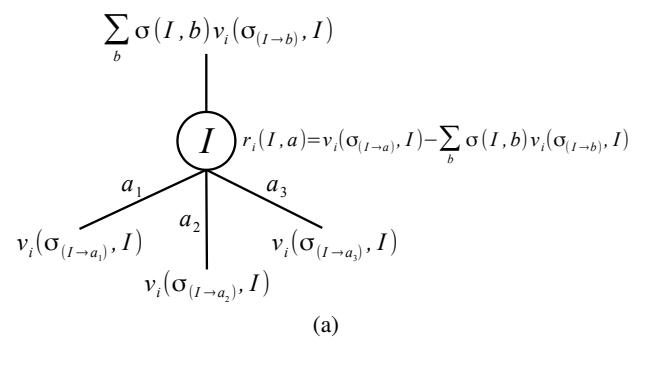
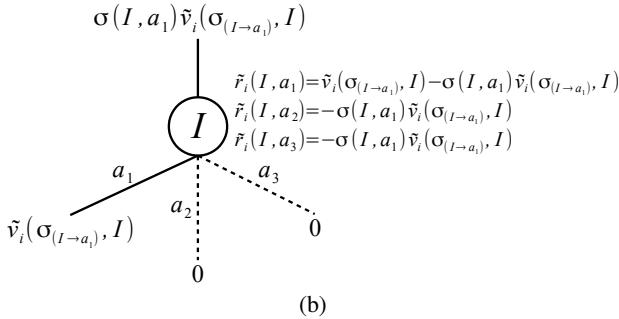
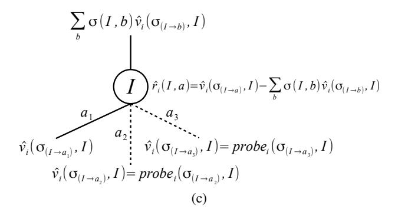
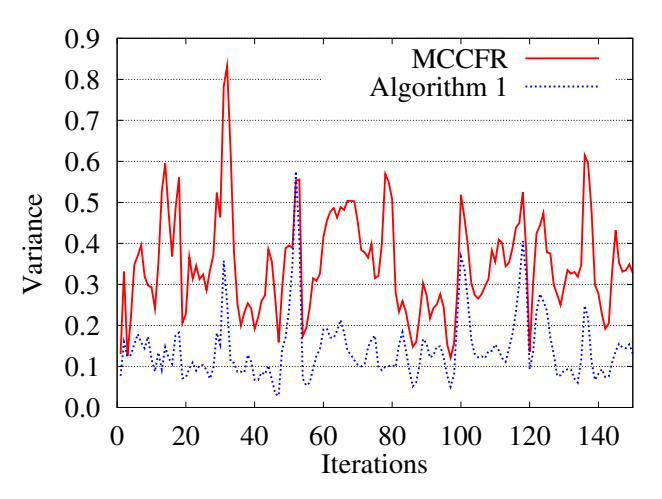
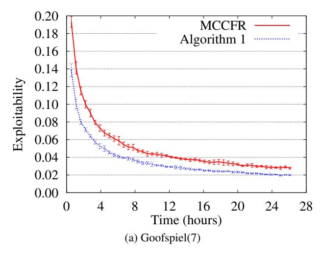
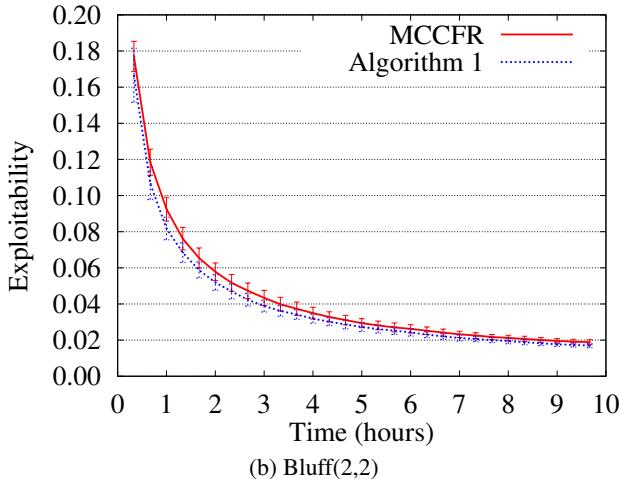
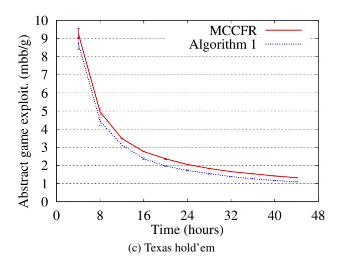

# Generalized Sampling and Variance in Counterfactual Regret Minimization

## Richard Gibson and Marc Lanctot and Neil Burch and Duane Szafron and Michael Bowling

Department of Computing Science, University of Alberta Edmonton, Alberta, T6G 2E8, Canada {rggibson | lanctot | nburch | dszafron | mbowling}@ualberta.ca

#### Abstract

In large extensive form games with imperfect information, Counterfactual Regret Minimization (CFR) is a popular, iterative algorithm for computing approximate Nash equilibria. While the base algorithm performs a full tree traversal on each iteration, Monte Carlo CFR (MCCFR) reduces the per iteration time cost by traversing just a sampled portion of the tree. On the other hand, MCCFR's sampled values introduce variance, and the effects of this variance were previously unknown. In this paper, we generalize MCCFR by considering any generic estimator of the sought values. We show that any choice of an estimator can be used to probabilistically minimize regret, provided the estimator is bounded and unbiased. In addition, we relate the variance of the estimator to the convergence rate of an algorithm that calculates regret directly from the estimator. We demonstrate the application of our analysis by defining a new bounded, unbiased estimator with empirically lower variance than MCCFR estimates. Finally, we use this estimator in a new sampling algorithm to compute approximate equilibria in Goofspiel, Bluff, and Texas hold'em poker. Under each of our selected sampling schemes, our new algorithm converges faster than MCCFR.

#### Introduction

An extensive form game is a common formalism used to model sequential decision making problems. Extensive games provide a versatile framework capable of representing multiple agents, imperfect information, and stochastic events. Counterfactual Regret Minimization (CFR) (Zinkevich et al. 2008) is an algorithm capable of finding effective strategies in a variety of games. In 2-player zero-sum games with perfect recall, CFR converges to an approximate Nash equilibrium profile. Other techniques for computing Nash equilibria include linear programming (Koller, Megiddo, and von Stengel 1994) and the Excessive Gap Technique (Hoda et al. 2010).

CFR is an iterative algorithm that updates every player's strategy through a full game tree traversal on each iteration. Theoretical results indicate that for a fixed solution quality, the procedure takes a number of iterations at most quadratic in the size of the game (Zinkevich et al. 2008, Theorem 4). As we consider larger games, however, traversals become

Copyright © 2012, Association for the Advancement of Artificial Intelligence (www.aaai.org). All rights reserved.

more time consuming, and thus more time is required to converge to an equilibrium.

Monte Carlo CFR (MCCFR) (Lanctot et al. 2009a) can be used to reduce the traversal time per iteration by considering only a sampled portion of the game tree at each step. Compared to CFR, MCCFR can update strategies faster and lead to less overall computation time. However, the strategy updates are noisy because any action that is not sampled is assumed to provide zero counterfactual value to the strategy. When a non-sampled action provides large value, MCCFR introduces a lot of variance. Previous work does not discuss how this variance affects the convergence rate.

Our main contributions in this paper result from a more general analysis of the effects of using sampled values in CFR updates. We show that any bounded, unbiased estimates of the true counterfactual values can be used to minimize regret, whether the estimates are derived from MC-CFR or not. Furthermore, we prove a new upper bound on the average regret in terms of the variance of the estimates, suggesting that estimates with lower variance are preferred. In addition to these main results, we introduce a new CFR sampling algorithm that lives outside of the MCCFR family of algorithms. By "probing" the value of non-sampled actions, our new algorithm demonstrates one way of reducing the variance in the updates to provide faster convergence to equilibrium. This is shown in three domains: Goofspiel, Bluff, and Texas hold'em poker.

### **Background**

A finite extensive game contains a game tree with nodes corresponding to **histories** of actions  $h \in H$  and edges corresponding to **actions**  $a \in A(h)$  available to **player**  $P(h) \in N \cup \{c\}$  (where N is the set of players and c denotes **chance**). When P(h) = c,  $\sigma_c(h, a)$  is the (fixed) probability of chance generating action a at h. We call h a **prefix** of history h', written  $h \sqsubseteq h'$ , if h' begins with the sequence h. Each **terminal history**  $z \in Z$  has associated **utilities**  $u_i(z)$  for each player i. In **imperfect information** games, non-terminal histories are partitioned into **information sets**  $I \in \mathcal{I}_i$  representing the different game states that player i cannot distinguish between. For example, in poker, player i does not see the private cards dealt to the opponents, and thus all histories differing only in the private cards of the opponents are in the same information set for player i. The ac-

tion sets A(h) must be identical for all  $h \in I$ , and we denote this set by A(I). We assume **perfect recall** that guarantees players always remember information that was revealed to them and the order in which it was revealed.

A strategy for player  $i, \sigma_i \in \Sigma_i$ , is a function that maps each information set  $I \in \mathcal{I}_i$  to a probability distribution over A(I). A strategy profile is a vector of strategies  $\sigma = (\sigma_1,...,\sigma_{|N|}) \in \Sigma$ , one for each player. Define  $u_i(\sigma)$  to be the expected utility for player i, given that all players play according to  $\sigma$ . We let  $\sigma_{-i}$  refer to the strategies in  $\sigma$  excluding  $\sigma_i$ .

Let  $\pi^{\sigma}(h)$  be the probability of history h occurring if all players choose actions according to  $\sigma$ . We can decompose

$$\pi^{\sigma}(h) = \prod_{i \in N \cup \{c\}} \pi_i^{\sigma}(h)$$

into each player's and chance's contribution to this probability. Here,  $\pi_i^{\sigma}(h)$  is the contribution to this probability from player i when playing according to  $\sigma_i$ . Let  $\pi_{-i}^{\sigma}(h)$  be the product of all players' contribution (including chance) except that of player i. Furthermore, let  $\pi^{\sigma}(h,h')$  be the probability of history h' occurring after h, given h has occurred. Let  $\pi_i^{\sigma}(h,h')$  and  $\pi_{-i}^{\sigma}(h,h')$  be defined similarly.

A **best response** to  $\sigma_{-i}$  is a strategy that maximizes player i's expected payoff against  $\sigma_{-i}$ . The **best response** value for player i is the value of that strategy,  $b_i(\sigma_{-i}) = \max_{\sigma_i' \in \Sigma_i} u_i(\sigma_i', \sigma_{-i})$ . A strategy profile  $\sigma$  is an  $\epsilon$ -Nash equilibrium if no player can unilaterally deviate from  $\sigma$  and gain more than  $\epsilon$ ; i.e.,  $u_i(\sigma) + \epsilon \geq b_i(\sigma_{-i})$  for all  $i \in N$ .

In this paper, we will focus on **two-player zero-sum** games:  $N = \{1, 2\}$  and  $u_1(z) = -u_2(z)$  for all  $z \in Z$ . In this case, the **exploitability** of  $\sigma$ ,  $e(\sigma) = (b_1(\sigma_2) + b_2(\sigma_1))/2$ , measures how much  $\sigma$  loses to a worst case opponent when players alternate positions. A 0-Nash equilibrium (or simply a **Nash equilibrium**) has zero exploitability.

Counterfactual Regret Minimization (CFR) is an iterative procedure that, for two-player zero-sum games, obtains an  $\epsilon$ -Nash equilibrium in  $O(|H||\mathcal{I}_i|/\epsilon^2)$  time (Zinkevich et al. 2008, Theorem 4). On each iteration t, CFR (or "vanilla CFR") recursively traverses the entire game tree, calculating the expected utility for player i at each information set  $I \in \mathcal{I}_i$  under the current profile  $\sigma^t$ , assuming player i plays to reach I. This expectation is the **counterfactual value** for player i,

$$v_i(\sigma,I) = \sum_{z \in Z_I} u_i(z) \pi_{-i}^{\sigma}(z[I]) \pi^{\sigma}(z[I],z),$$

where  $Z_I$  is the set of terminal histories passing through I and z[I] is the prefix of z contained in I. For each action  $a \in A(I)$ , these values determine the **counterfactual regret** at iteration t,  $r_i^t(I,a) = v_i(\sigma_{(I \to a)}^t, I) - v_i(\sigma^t, I)$ , where  $\sigma_{(I \to a)}$  is the profile  $\sigma$  except at I, action a is always taken. This process is shown visually in Figure 1a. The regret  $r_i^t(I,a)$  measures how much player i would rather play action a at I than play  $\sigma^t$ . The counterfactual regrets

$$R_i^T(I, a) = \sum_{t=1}^{T} r_i^t(I, a)$$







Figure 1: (a) The computed values at information set I during vanilla CFR. First, for each action, the counterfactual values are recursively computed. The counterfactual regrets are then computed before returning the counterfactual value at I to the parent. (b) The computed values at I during outcome sampling. Here, only action  $a_1$  is sampled and its sampled counterfactual value is recursively computed. The remaining two actions are effectively assigned zero sampled counterfactual value. The sampled counterfactual regrets are then computed before returning the sampled counterfactual value at I to the parent. (c) An example of computed values at I during our new sampling algorithm. In this example, again only  $a_1$  is sampled and its estimated counterfactual value is recursively computed. The remaining two actions are "probed" to improve both the estimated counterfactual regrets and the returned estimated counterfactual value at I.

are accumulated and  $\sigma^t$  is updated by applying regret matching (Hart and Mas-Colell 2000; Zinkevich et al. 2008) to the

accumulated regrets,

$$\sigma^{T+1}(I,a) = \frac{R_i^{T,+}(I,a)}{\sum\limits_{b \in A(I)} R_i^{T,+}(I,b)}$$
(1)

where  $x^+ = \max\{x,0\}$  and actions are chosen uniformly at random when the denominator is zero. This procedure minimizes the average of the counterfactual regrets, which in turn minimizes the **average (external) regret**  $R_i^T/T$  (Zinkevich et al. 2008, Theorem 3), where

$$R_i^T = \max_{\sigma' \in \Sigma_i} \sum_{t=1}^T \left( u_i(\sigma', \sigma_{-i}^t) - u_i(\sigma_i^t, \sigma_{-i}^t) \right).$$

It is well known that in a two-player zero-sum game, if  $R_i^T/T < \epsilon$  for  $i \in \{1,2\}$ , then the average profile  $\bar{\sigma}^T$  is a  $2\epsilon$ -Nash equilibrium.

For large games, CFR's full game tree traversal can be very expensive. Alternatively, one can still obtain an approximate equilibrium by traversing a smaller, sampled portion of the tree on each iteration using **Monte Carlo CFR (MC-CFR)** (Lanctot et al. 2009a). Let  $\mathcal{Q}$  be a set of subsets, or **blocks**, of the terminal histories Z such that the union of  $\mathcal{Q}$  spans Z. On each iteration, a block  $Q \in \mathcal{Q}$  is sampled according to a probability distribution over  $\mathcal{Q}$ . **Outcome sampling** is an example of MCCFR that uses blocks containing a single terminal history ( $Q = \{z\}$ ). On each iteration of outcome sampling, the block is chosen during traversal by sampling a single action at the current decision point until a terminal history is reached. The **sampled counterfactual value** for player i,

$$\tilde{v}_i(\sigma,I) = \sum_{z \in Z_I \cap Q} u_i(z) \pi_{-i}^{\sigma}(z[I]) \pi^{\sigma}(z[I],z) / q(z)$$

where q(z) is the probability that z was sampled, defines the **sampled counterfactual regret** on iteration t for action a at I,  $\tilde{r}_i^t(I,a) = \tilde{v}_i(\sigma_{(I \to a)}^t,I) - \tilde{v}_i(\sigma^t,I)$ . The sampled counterfactual values are unbiased estimates of the true counterfactual values (Lanctot et al. 2009a, Lemma 1). In outcome sampling, for example, only the regrets along the sampled terminal history are computed (all others are zero by definition). Outcome sampling converges to equilibrium faster than vanilla CFR in a number of different games (Lanctot et al. 2009a, Figure 1).

As we sample fewer actions at a given node, the sampled counterfactual value is potentially less accurate. Figure 1b illustrates this point in the case of outcome sampling. Here, an "informative" sampled counterfactual value for just a single action is obtained at each information set along the sampled block (history). All other actions are assigned a sampled counterfactual value of zero. While  $\mathbf{E}_{\mathcal{Q}}[\tilde{v}_i(\sigma,I)] = v_i(\sigma,I)$ , variance is introduced, affecting both the regret updates and the value recursed back to the parent. As we will see in the next section, this variance plays an important role in the number of iterations required to converge.

#### Generalized Sampling

Our main contributions in this paper are new theoretical findings that generalize those of MCCFR. We begin by presenting a previously established bound on the average regret achieved through MCCFR. Let  $|A_i| = \max_{I \in \mathcal{I}_i} |A(I)|$  and suppose  $\delta > 0$  satisfies the following:  $\forall z \in Z$  either  $\pi^{\sigma}_{-i}(z) = 0$  or  $q(z) \geq \delta > 0$  at every iteration. We can then bound the difference between any two samples  $\tilde{v}_i(\sigma_{(I \to a)}, I) - \tilde{v}_i(\sigma_{(I \to b)}, I) \leq \tilde{\Delta}_i = \Delta_i/\delta$ , where  $\Delta_i = \max_{z \in Z} u_i(z) - \min_{z \in Z} u_i(z)$ . The average regret can then be bounded as follows:

**Theorem 1 (Lanctot et al. (2009a), Theorem 5)** Let  $p \in (0,1]$ . When using outcome-sampling MCCFR, with probability 1-p, average regret is bounded by

$$\frac{R_i^T}{T} \le \left(\tilde{\Delta}_i + \frac{\sqrt{2}\tilde{\Delta}_i}{\sqrt{p}}\right) \frac{|\mathcal{I}_i|\sqrt{|A_i|}}{\sqrt{T}}.$$
 (2)

A related bound holds for all MCCFR instances (Lanctot et al. 2009b, Theorem 7). We note here that Lanctot et al. present a slightly tighter bound than equation (2) where  $|\mathcal{I}_i|$  is replaced with a game-dependent constant  $M_i$  that is independent of the sampling scheme and satisfies  $\sqrt{|\mathcal{I}_i|} \leq M_i \leq |\mathcal{I}_i|$ . This constant is somewhat complicated to define, and thus we omit these details here. Recall that minimizing the average regret yields an approximate Nash equilibrium. Theorem 1 suggests that the rate at which regret is minimized depends on the bound  $\tilde{\Delta}_i$  on the difference between two sampled counterfactual values.

We now present a new, generalized bound on the average regret. While MCCFR provides an explicit form for the sampled counterfactual values  $\tilde{v}_i(\sigma,I)$ , we let  $\hat{v}_i(\sigma,I)$  denote any estimator of the true counterfactual value  $v_i(\sigma,I)$ . We can then define the **estimated counterfactual regret** on iteration t for action a at I to be  $\hat{r}_i^t(I,a) = \hat{v}_i(\sigma_{(I \to a)}^t,I) - \hat{v}_i(\sigma^t,I)$ . This generalization creates many possibilities not considered in MCCFR. For instance, instead of sampling a block Q of terminal histories, one can consider a sampled set of information sets and only update regrets at those sampled locations. Another example is provided later in the paper.

The following lemma probabilistically bounds the average regret in terms of the variance, covariance, and bias between the estimated and true counterfactual regrets:

**Lemma 1** Let  $p \in (0,1]$  and suppose that there exists a bound  $\hat{\Delta}_i$  on the difference between any two estimates,  $\hat{v}_i(\sigma_{(I \to a)}, I) - \hat{v}_i(\sigma_{(I \to b)}, I) \leq \hat{\Delta}_i$ . If strategies are selected according to regret matching on the estimated counterfactual regrets, then with probability at least 1-p, the average regret is bounded by

$$\frac{R_i^T}{T} \leq |\mathcal{I}_i| \sqrt{|A_i|} \left( \frac{\hat{\Delta}_i}{\sqrt{T}} + \sqrt{\frac{\mathbf{Var}}{pT} + \frac{\mathbf{Cov}}{p} + \frac{\mathbf{E}^2}{p}} \right)$$

where

$$\begin{aligned} \mathbf{Var} &= \max_{\substack{t \in \{1, \dots, T\} \\ I \in \mathcal{I}_i \\ a \in A(I)}} \mathbf{Var} \left[ r_i^t(I, a) - \hat{r}_i^t(I, a) \right], \end{aligned}$$

with Cov and E similarly defined.

The proof is similar to that of Theorem 7 by Lanctot et al. (2009b) and can be found, along with all other proofs, in the technical report (Gibson et al. 2012). Lemma 1 implies that unbiased estimators of  $v_i(\sigma, I)$  give a probabilistic guarantee of minimizing  $R_i^T/T$ :

**Theorem 2** If in addition to the conditions of Lemma 1,  $\hat{v}_i(\sigma, I)$  is an unbiased estimator of  $v_i(\sigma, I)$ , then with probability at least 1 - p,

$$\frac{R_i^T}{T} \le \left(\hat{\Delta}_i + \frac{\sqrt{\mathbf{Var}}}{\sqrt{p}}\right) \frac{|\mathcal{I}_i|\sqrt{A_i}}{\sqrt{T}}.$$
 (3)

Theorem 2 shows that the bound on the difference between two estimates,  $\hat{\Delta}_i$ , plays a role in bounding the average overall regret. This is not surprising as  $\tilde{\Delta}_i$  plays a similar role in Theorem 1. However, Theorem 2 provides new insight into the role played by the variance of the estimator. Given two unbiased estimators  $\hat{v}_i(\sigma, I)$  and  $\hat{v}'_i(\sigma, I)$  with a common bound  $\hat{\Delta}_i$  but differing variance, using the estimator with lower variance will yield a smaller bound on the average regret after T iterations. For a fixed  $\epsilon > 0$ , this suggests that estimators with lower variance will require fewer iterations to converge to an  $\epsilon$ -Nash equilibrium. In addition, since in MCCFR we can bound  $\sqrt{\text{Var}} < \sqrt{2} \max{\{\tilde{\Delta}_i, \Delta_i\}}$ , equation (3) is more informative than equation (2). Furthermore, if some structure on the estimates  $\hat{v}_i(\sigma, I)$  holds, we can produce a tighter bound than equation (3) by incorporating the game-dependent constant  $M_i$  introduced by Lanctot et al. (2009a). Details of this improvement are included in the technical report (Gibson et al. 2012).

While unbiased estimators with lower variance may reduce the number of iterations required, we must define these estimators carefully. If the estimator is expensive to compute, the time per iteration will be costly and overall computation time may even increase. For example, the true counterfactual value  $v_i(\sigma,I)$  has zero variance, but computing the value with vanilla CFR is too time consuming in large games. In the next section, we present a new bounded, unbiased estimator that exhibits lower variance than  $\tilde{v}_i(\sigma,I)$  and can be computed nearly as fast.

### A New CFR Sampling Algorithm

We now provide an example of how our new theoretical findings can be leveraged to reduce the computation time required to obtain an  $\epsilon$ -Nash equilibrium. Our example is an extension of MCCFR that attempts to reduce variance by replacing "zeroed-out" counterfactual values of player i's nonsampled actions with closer estimates of the true counterfactual values. Figure 1c illustrates this idea. The simplest instance of our new algorithm "probes" each non-sampled action a at I for its counterfactual value. A probe is a single Monte Carlo roll-out, starting with action a at I and selecting subsequent actions according to the current strategy  $\sigma^t$  until a terminal history z is reached. By rolling out actions according to the current strategy, a probe is guaranteed to provide an unbiased estimate of the counterfactual value for a at I. In general, one can perform multiple probes per non-sampled action, probe only a subset of the non-sampled actions, probe off-policy, or factor in multiple terminal histories per probe. While the technical report touches on this generalization (Gibson et al. 2012), our presentation here sticks to the simple, inexpensive case of one on-policy, single trajectory probe for each non-sampled action.

We now formally define the estimated counterfactual value  $\hat{v}_i(\sigma, I)$  obtained via probing, followed by a description of a new CFR sampling algorithm that updates regrets according to these estimates. Similar to MCCFR, let Q be a set of blocks spanning Z from which we sample a block  $Q \in \mathcal{Q}$  for player i on every iteration. To further simplify our discussion, we will assume from here on that each Q samples a single action at every history h not belonging to player i, sampled according to the known chance probabilities  $\sigma_c$  or the opponent's current strategy  $\sigma_{-i}$ . Additionally, we assume that the set of actions sampled at  $I \in \mathcal{I}_i$ , denoted Q(I), is nonempty and independent of every other set of actions sampled. While probing can be generalized to work for any choice of Q (Gibson et al. 2012), this simplification reduces the number of probabilities to compute in our algorithm and worked well in preliminary experiments. Once Q has been sampled, we form an additional set of terminal histories, or **probes**,  $B \subseteq Z \backslash Q$ , generated as follows. For each non-terminal history h with P(h) = i reached and each action  $a \in A(h)$  that Q does not sample (i.e.,  $\exists z \in Q$  such that  $h \sqsubseteq z$ , but  $\forall z \in Q, ha \not\sqsubseteq z$ ), we generate exactly one terminal history  $z = z_{ha} \in B$ , where  $z \in Z \backslash Q$  is selected on-policy (i.e., with probability  $\pi^{\sigma}(ha, z)$ ). In other words, each non-sampled action is probed according to the current strategy profile  $\sigma$  and the known chance probabilities. Recall that  $Z_I$  is the set of terminal histories that have a prefix in the information set I. Given both Q and B, when  $Z_I \cap Q \neq \emptyset$ , our estimated counterfactual value is defined to be

$$\hat{v}_i(\sigma, I) = \frac{1}{q_i(I)} \left[ \sum_{z \in Z_I \cap Q} \pi_i^{\sigma}(z[I], z) u_i(z) + \sum_{z_{ha} \in Z_I \cap B} \pi_i^{\sigma}(z_{ha}[I], ha) u_i(z_{ha}) \right],$$

where

$$q_i(I) = \prod_{(I',a') \in X_i(I)} \mathbf{P}[a' \in Q(I')]$$

is the probability that  $Z_I\cap Q\neq\emptyset$  contributed from sampling player i's actions. Here,  $X_i(I)$  is the sequence of information set, action pairs for player i that lead to information set I, and this sequence is unique due to perfect recall. When  $Z_I\cap Q=\emptyset$ ,  $\hat{v}_i(\sigma,I)$  is defined to be zero.

**Proposition 1** If  $q_i(I) > 0$  for all  $I \in \mathcal{I}_i$ , then  $\hat{v}_i(\sigma, I)$  is a bounded, unbiased estimate of  $v_i(\sigma, I)$ .

Proposition 1 and Theorem 2 provide a probabilistic guarantee that updating regrets according to our estimated counterfactual values will minimize the average regret, and thus produce an  $\epsilon$ -Nash equilibrium. Note that the differences  $\tilde{v}_i(\sigma_{(I \to a)}, I) - \tilde{v}_i(\sigma_{(I \to b)}, I)$  and  $\hat{v}_i(\sigma_{(I \to a)}, I) - \hat{v}_i(\sigma_{(I \to b)}I)$  are both bounded above by  $\hat{\Delta}_i = \Delta_i/\delta$ , where  $\delta = \min_{I \in \mathcal{I}_i} q_i(I)$ . Thus, Theorem 2 suggests that variance

reduction should lead to less regret after a fixed number of iterations. Probing specifically aims to achieve variance reduction through  $\hat{v}_i(\sigma, I)$  when only a strict subset of player i's actions are sampled. Note that if we always sample all of player i's actions, we have  $B = \emptyset$  and  $\hat{v}_i(\sigma, I) = \tilde{v}_i(\sigma, I)$ .

Algorithm 1 provides pseudocode for our new algorithm that updates regrets according to our estimated counterfactual values. The Probe function recurses down the tree from history h following a single trajectory according to the known chance probabilities (line 9) and the current strategy obtained through regret matching (line 13, see equation (1)) until the utility at a single terminal history is returned (line 7). The WalkTree function is the main part of the algorithm and contains three major cases. Firstly, if the current history h is a terminal history, we simply return the utility (line 19). Second, if player i does not act at h (lines 20 to 31), then our assumption on Q dictates that a single action is traversed onpolicy (lines 21 and 29). The third case covers player i acting at h (lines 32 to 46). After sampling a set of actions (line 34), the value of each action a, v[a], is obtained. For each sampled action, we obtain its value by recursing down that action (line 38) after updating the sample probability for future histories (line 37). While MCCFR assigns zero value to each non-sampled action, Algorithm 1 instead obtains these action values through the probe function (line 40). Note that  $q = q_i(I)$  is the probability of reaching I contributed from sampling player i's actions, and that the estimated counterfactual value  $\hat{v}_i(\sigma_{(I \to a)}, I) = v[a]/q$ . After obtaining all values, the regret of each action is updated (line 44).

Running the Solve function for a large enough number of iterations T will produce an approximate Nash equilibrium  $\bar{\sigma}$ , where  $\bar{\sigma}(I,a) = s_I[a]/\sum_{b \in A(I)} s_I[b]$ . Note that Algorithm 1 updates the cumulative profile (line 27) in a slightly different manner than the MCCFR algorithm presented by Lanctot et al. (2009b, Algorithm 1). Firstly, we divide the update by the probability  $q_i(I)$  of reaching I under  $\mathcal{Q}$  (which Lanctot et al. call updating "stochastically"), as opposed to "optimistic averaging" that the authors mention is not technically correct. Second, we update player i's part of the profile during the opponent's traversal instead of during player i's traversal. Doing so ensures that any information set that will contribute positive probability to the cumulative profile can be reached, which along with stochastic updating produces an unbiased update. These changes are not specific to our new algorithm and can also be applied to MCCFR.

## **Experimental Results**

In this section, we compare MCCFR to our new sampling algorithm in three domains, which we now describe.

Goofspiel(n) is a card-bidding game consisting of n rounds. Each player begins with a hand of bidding cards numbered 1 to n. In our version, on round k, players secretly and simultaneously play one bid from their remaining cards and the player with the highest bid receives n-k+1 points; in the case of a tie, no points are awarded. The player with the highest score after n rounds receives a utility of +1 and the other player earns -1, and both receive 0 utility in a tie. Our version of Goofspiel is less informative than conven-

## Algorithm 1 CFR sampling with probing

```
1: Require: \forall I, action set sampling distribution \mathcal{Q}(I)
 2: Initialize regret: \forall I, \forall a \in A(I) : r_I[a] \leftarrow 0
     Initialize cumulative profile: \forall I, \forall a \in A(I) : s_I[a] \leftarrow 0
 5: function Probe(history h, player i):
 6:
        if h \in Z then
 7:
             return u_i(h)
 8:
         else if h \in P(c) then
 9:
             Sample action a \sim \sigma_c(h, \cdot)
10:
         else
             I \leftarrow \text{Information set containing } h
11:
12:
             \sigma \leftarrow \text{RegretMatching}(r_I)
13:
             Sample action a \sim \sigma
14:
15:
         return Probe(ha, i)
16.
17: function WalkTree(history h, player i, sample prob q):
18:
        if h \in Z then
19:
             return u_i(h)
20:
         else if h \in P(c) then
21:
             Sample action a \sim \sigma_c(h, \cdot)
22:
             return WalkTree(ha, i, q)
        else if h \notin P(i) then
23:
24:
             I \leftarrow \text{Information set containing } h
             \sigma \leftarrow \text{RegretMatching}(I)
25:
             for a \in A(I) do
26:
27:
                s_I[a] \leftarrow s_I[a] + (\sigma[a]/q)
28:
29:
             Sample action a \sim \sigma
30:
             return WalkTree(ha, i, q)
31:
         end if
32:
         I \leftarrow \text{Information set containing } h
33:
         \sigma \leftarrow \text{RegretMatching}(r_I)
34:
         Sample action set Q(I) \sim Q(I)
35:
         for a \in A(I) do
36:
             if a \in Q(I) then
                q' \leftarrow q \cdot \mathbf{P}_{\mathcal{Q}(I)}[a \in Q(I)]
37:
38:
                v[a] \leftarrow \text{WalkTree}(ha, i, q')
39:
             else
40:
                v[a] \leftarrow \text{Probe}(ha, i)
41:
             end if
         end for
42:
         for a \in A(I) do
43:
            r_I[a] \leftarrow r_I[a] + (1/q) \left( v[a] - \sum_{b \in A(I)} \sigma[b] v[b] \right)
44:
         end for
45:
        return \sum_{a \in A(I)} \sigma[a]v[a]
46:
47:
48: function Solve(iterations T):
         for t \in \{1, 2, ..., T\} do
49:
             WalkTree(\emptyset, 1, 1)
50:
51:
             WalkTree(\emptyset, 2, 1)
52:
         end for
```

tional Goofspiel as players know which of the previous bids were won or lost, but not which cards the opponent played. Bluff $(D_1,D_2)$  is a dice-bidding game played over a number of rounds. Each player i starts with  $D_i$  six-sided dice. In each round, players roll their dice and look at the result without showing their opponent. Then, players alternate by bidding a quantity of a face value, q-f, of all dice in play until one player claims that the other is bluffing (i.e., claims that the bid does not hold). To place a new bid, a player must increase q or f of the current bid. A face of 6 is considered "wild" and counts as any other face value. The player calling bluff wins the round if the opponent's last bid is incorrect, and loses otherwise. The losing player removes one of their dice from the game and a new round begins. Once a player has no more dice left, that player loses the game and receives a utility of -1, while the winning player earns +1 utility.

Finally, we consider heads-up (i.e., two-player) limit Texas hold'em poker that is played over four betting rounds. To begin, each player is dealt two private cards. In later rounds, public community cards are revealed with a fifth and final card appearing in the last round. During each betting round, players can either fold (forfeit the game), call (match the previous bet), or raise (increase the previous bet), with a maximum of four raises per round. If neither player folds, then the player with the highest ranked poker hand wins all of the bets. Hold'em contains approximately  $3 \times 10^{14}$  information sets, making the game intractable for any equilibrium computation technique. A common approach in poker is to apply a card abstraction that merges similar card dealings together into a single chance "bucket" (Gilpin and Sandholm 2006). We apply a ten-bucket abstraction that reduces the branching factor at each chance node down to ten, where dealings are grouped according to expected hand strength squared as described by Zinkevich et al. (2008). This abstract game contains roughly 57 million information sets.

We use domain knowledge and our intuition to select the sampling schemes Q. By our earlier assumption, we always sampling a single action on-policy when  $P(h) \neq i$ , as is done in Algorithm 1. For the traversing player i, we focus on sampling actions leading to more "important" parts of the tree, while sampling other actions less frequently. Doing so updates the regret at the important information sets more frequently to quickly improve play at those locations. In Goofspiel, we always sample the lowest and highest bids, while sampling each of the remaining bids independently with probability 0.5. Strong play can be achieved by only ever playing the highest bid (giving the best chance at winning the bid) or the lowest bid (sacrificing the current bid, leaving higher cards for winning future bids), suggesting that these actions will often be taken in equilibrium. In Bluff(2,2), we always sample "bluff" and the bids 1-5, 2-5, 1-6, 2-6, and for each face x that we roll, n-x for all  $1 \le n \le 4$ . Bidding on the highest face is generally the best bluff since the opponent's next bid must increase the quantity, and bidding on one's own dice roll is more likely to be correct. Finally, in hold'em, we always sample fold and raise actions, while sampling call with probability 0.5. Folds are cheap to sample (since the game ends) and raise actions increase the number of bets and consequently the magnitude of the utilities.

Firstly, we performed a test run of CFR in Goofspiel(6) that measured the empirical variance of the samples  $\tilde{v}_i(\sigma, I)$ 



Figure 2: Empirical  $\mathbf{Var}[\tilde{v}_i(\sigma^t, I)]$  and  $\mathbf{Var}[\hat{v}_i(\sigma^t, I)]$  over iterations at the root of Goofspiel(6) in a test run of CFR.

provided by MCCFR and of  $\hat{v}_i(\sigma, I)$  provided by Algorithm 1. During each iteration t of the test run, we performed 2000 traversals with no regret or strategy updates, where the first 1000 traversals computed  $\tilde{v}_i(\sigma^t, I)$  and the second 1000 computed  $\hat{v}_i(\sigma^t,I)$  at the root I of the game. Both  $\tilde{v}_i(\sigma^t, I)$  and  $\hat{v}_i(\sigma^t, I)$  were computed under the same sampling scheme Q described above for Goofspiel. Once the empirical variance of each estimator was recorded from the samples at time t, a full vanilla CFR traversal was then performed to update the regrets and acquire the next strategy  $\sigma^{t+1}$ . The first 150 empirical variances are reported in Figure 2. Since the estimators are unbiased, the variance here is also equal to the mean squared error of the estimates. Over 1000 test iterations, the average variances were 0.295 for MCCFR and 0.133 for Algorithm 1. This agrees with our earlier intuition that probing reduces variance and provides some validation for our choice of estimator.

Next, we performed five runs for each of MCCFR and Algorithm 1, each under the same sampling schemes  $\mathcal Q$  described above. Similar to Algorithm 1, our MCCFR implementation also performs stochastic averaging during the opponent's tree traversal. For each domain, the average of the results are provided in Figure 3. Our new algorithm converges faster than MCCFR in all three domains. In particular, at our final data points, Algorithm 1 shows a 31%, 10%, and 18% improvement over MCCFR in Goofspiel(7), Bluff(2,2), and Texas hold'em respectively. For both Goofspiel(7) and hold'em, the improvement was statistically significant. In Goofspiel(7), for example, the level of exploitability reached by MCCFR's last averaged data point is reached by Algorithm 1 in nearly half the time.

## **Conclusion**

We have provided a new theoretical framework that generalizes MCCFR and provides new insights into how the estimated values affect the rate of convergence to an approximate Nash equilibrium. As opposed to the sampled counterfactual values  $\tilde{v}_i(\sigma, I)$  explicitly defined by MCCFR, we considered any estimate  $\hat{v}_i(\sigma, I)$  of the true counterfac-

tual values. We showed that the average regret is minimized (probabilistically) when the estimates are bounded and unbiased. In addition, we derived an upper bound on the average regret in terms of the variance of the estimates, suggesting that estimators with lower variance will converge to an  $\epsilon\textsc{-Nash}$  equilibrium in fewer iterations. Finally, we provided an example of a non-MCCFR algorithm that reduces variance with little computational overhead by probing nonsampled actions. Our new algorithm approached equilibrium faster than its MCCFR counterpart in all of the reported experiments. We suspect that there are other efficiently-computable definitions of  $\hat{v}_i(\sigma,I)$  that are bounded, unbiased, and exhibit lower variance than our probing example. Future work will attempt to further improve convergence rates through such alternative definitions.

## Acknowledgements

We would like to thank the members of the Computer Poker Research Group at the University of Alberta for their helpful suggestions throughout this project. This work was supported by NSERC, Alberta Innovates – Technology Futures, and the use of computing resources provided by WestGrid and Compute Canada.

#### References

Gibson, R.; Lanctot, M.; Burch, N.; Szafron, D.; and Bowling, M. 2012. Generalized sampling and variance in counterfactual regret minimization. Technical Report TR12-02, University of Alberta.

Gilpin, A., and Sandholm, T. 2006. A competitive Texas Hold'em poker player via automated abstraction and real-time equilibrium computation. In *Twenty-First Conference on Artificial Intelligence (AAAI)*, 1007–1013.

Hart, S., and Mas-Colell, A. 2000. A simple adaptive procedure leading to correlated equilibrium. *Econometrica* **68**:1127–1150.

Hoda, S.; Gilpin, A.; Peña, J.; and Sandholm, T. 2010. Smoothing techniques for computing Nash equilibria of sequential games. *Mathematics of Operations Research* **35**(2):494–512.

Koller, D.; Megiddo, N.; and von Stengel, B. 1994. Fast algorithms for finding randomized strategies in game trees. In *Annual ACM Symposium on Theory of Computing (STOC'94)*, 750–759.

Lanctot, M.; Waugh, K.; Zinkevich, M.; and Bowling, M. 2009a. Monte Carlo sampling for regret minimization in extensive games. In *Advances in Neural Information Processing Systems* 22 (NIPS), 1078–1086.

Lanctot, M.; Waugh, K.; Zinkevich, M.; and Bowling, M. 2009b. Monte Carlo sampling for regret minimization in extensive games. Technical Report TR09-15, University of Alberta.

Zinkevich, M.; Johanson, M.; Bowling, M.; and Piccione, C. 2008. Regret minimization in games with incomplete information. In *Advances in Neural Information Processing Systems* 20 (NIPS), 905–912.







Figure 3: Exploitability over time of strategies computed by MCCFR and by Algorithm 1 using identical sampling schemes Q, averaged over five runs. Error bars indicate 95% confidence intervals at each of the five averaged data points. In hold'em, exploitability is measured in terms of milli-bigblinds per game (mbb/g).